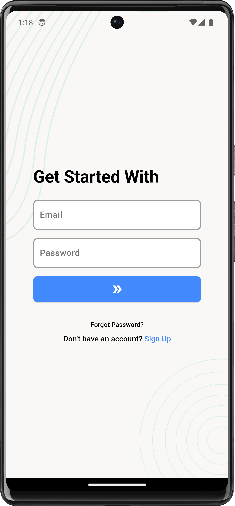
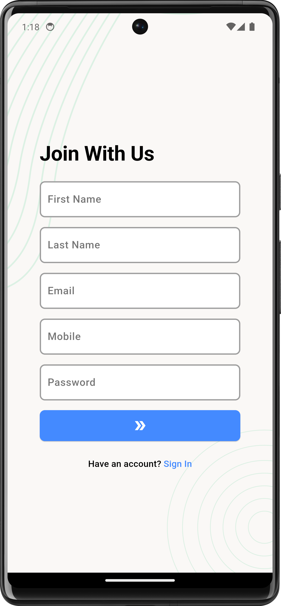
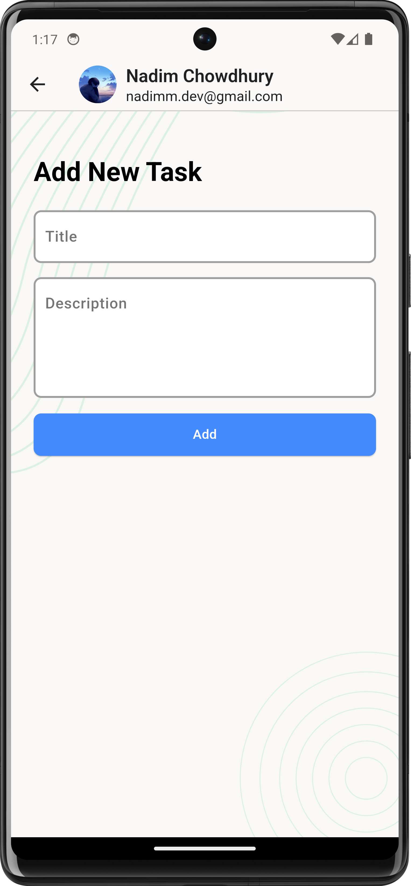
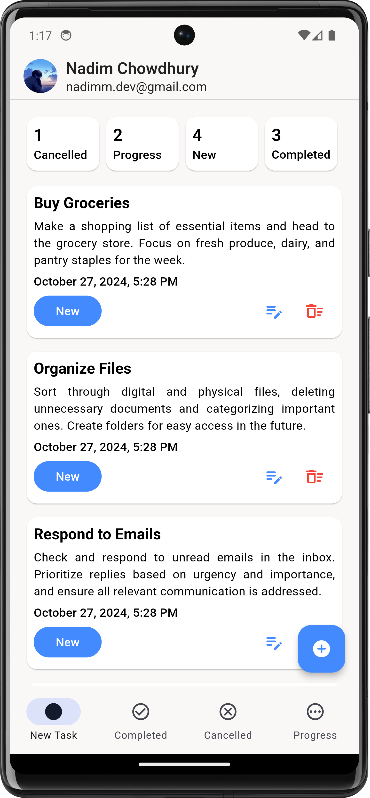
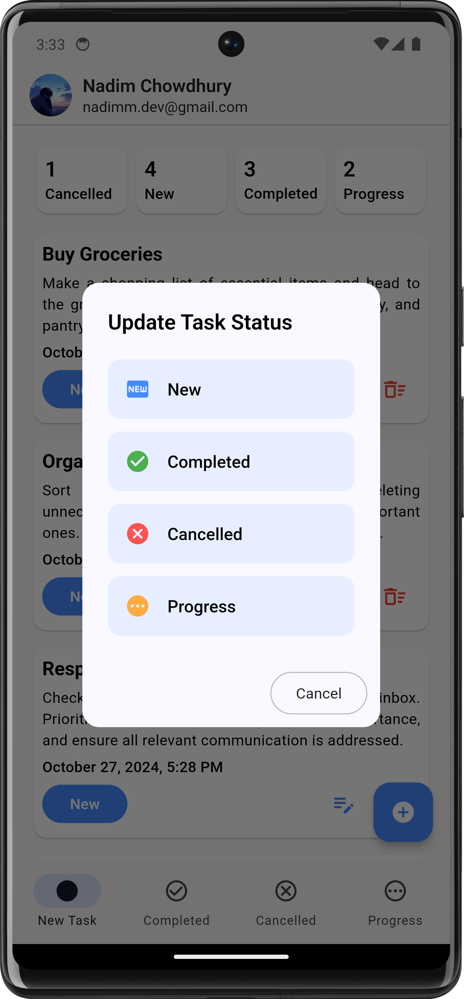
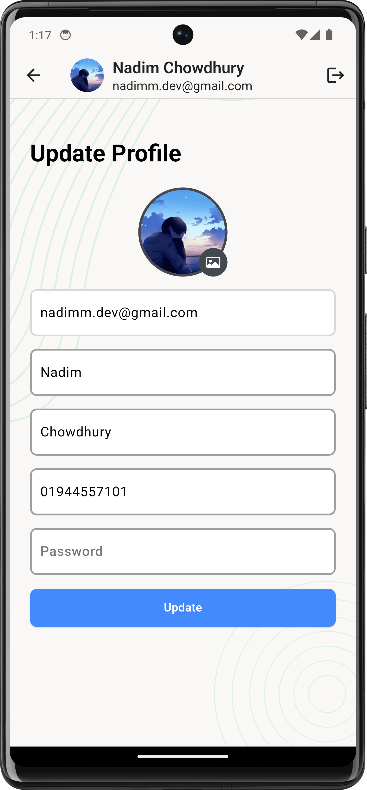

# Task-Mate

Task-Mate is a productivity-focused task management app developed using Flutter. It helps users efficiently manage their daily tasks and to-dos, with features such as task creation, editing, and tracking. Task-Mate utilizes REST API integration for data synchronization and Shared Preferences for storing preferences locally.

## ✨ Features

- **Task Management**: Create, edit, delete, and mark tasks as complete.
- **Data Synchronization**: Sync tasks with a server using REST API.
- **Beautiful UI**: Clean and intuitive UI for enhanced user experience.

## ⚙️ Tech Stack

- **Flutter**: Frontend framework for building cross-platform mobile apps.
- **Dart**: Programming language for Flutter development.
- **REST API**: For task synchronization with the server.
- **Shared Preferences**: Local storage for user preferences.

## 📸 Screenshots

| Sign In Screen | Sign Up Screen | Add New Task Screen |
|----------------|----------------|----------------------|
|  |  |  |

| Task List Screen | Update Task Screen | Profile Update Screen |
|------------------|--------------------|-----------------|
|  |  |  |

## 📬 Contact

If you have any questions or want to get in touch, you can reach me
at [nadimchowdhury87@gmail.com](mailto:nadimchowdhury87@gmail.com).
